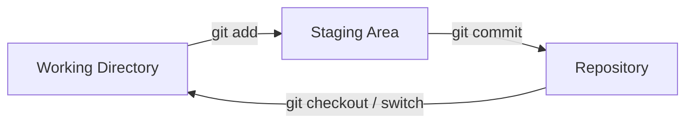
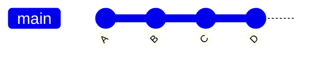
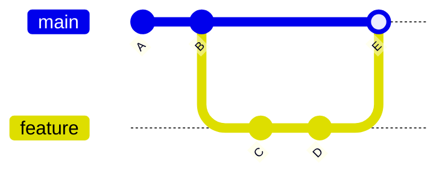
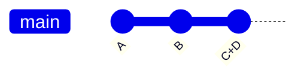

# Git Cheat Sheet & Quick Revision

A concise reference guide for essential Git operations, workflows, and branching strategies.

---

## 1. Setup & Configuration

Verify installation and configure global identity settings.

```bash
# Check installed Git version
git --version

# Access Git help documentation
git --help

# Set global user identity
git config --global user.name "Your Name"
git config --global user.email "you@example.com"

# List all current global configurations
git config --global --list
```

---

## 2. Core Workflow & Lifecycle



### Basic Commands

| Command | Action |
| :--- | :--- |
| `git init` | Initialize a new local Git repository |
| `git status` | Check working directory & staging area state |
| `git add <path>` | Stage specific file/folder (e.g., `git add src/*`) |
| `git commit -m "msg"` | Save staged changes with a descriptive message |

```bash
# Example Workflow:
git init
git status
git add src/*
git commit -m "Initial commit"
```

---

## 3. History & Inspection

Track history and inspect code changes across stages.

### Viewing History

```bash
git log                  # Detailed commit history
git log --oneline        # Compact single-line summary per commit
git log --graph          # Visual branch topology
git log --all --graph --oneline  # Full repository history graph
```

### Inspecting Differences (`git diff`)

```bash
git diff                 # Working directory vs. Staging area
git diff --staged        # Staging area vs. Last commit (HEAD)
git diff HEAD~1          # Current commit vs. Previous commit
git diff src/index.html  # Working directory changes for specific file
git diff --staged src/index.html # Staged changes for specific file
```

---

## 4. Time Travel & Checkout

Switch contexts or restore working directory files to earlier commits.

```bash
# Move to a specific commit
git checkout <commit-id>

# Return to the latest commit on the main branch
git checkout main
```

---

## 5. Branching & Merging

Isolate feature development and combine changes back into target branches.

```bash
# Branch Operations
git branch my-new-feature     # Create a new branch
git checkout my-new-feature   # Switch to the new branch
```

### Merge Types & Topologies

#### 0. Orignal Scenario Before Merge

gitGraph LR:
   commit id: "A"
   commit id: "B"
   branch feature
   commit id: "C"
   commit id: "D"


#### A. Fast-Forward Merge
Occurs when target branch has no new commits since branching.



#### B. Non-Fast-Forward Merge (`--no-ff`)
Explicitly creates a merge commit to preserve history context.



```bash
# Combine branch history with an explicit merge commit
git merge --no-ff fix-incomplete-high-score -m "Fix high score tracker"
```

#### C. Squash Merge
Combines all feature branch commits into a single commit on the target branch.



```bash
# Squash merge feature branch into current branch
git merge --squash <feature-branch>
```